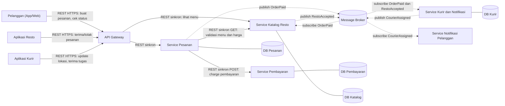
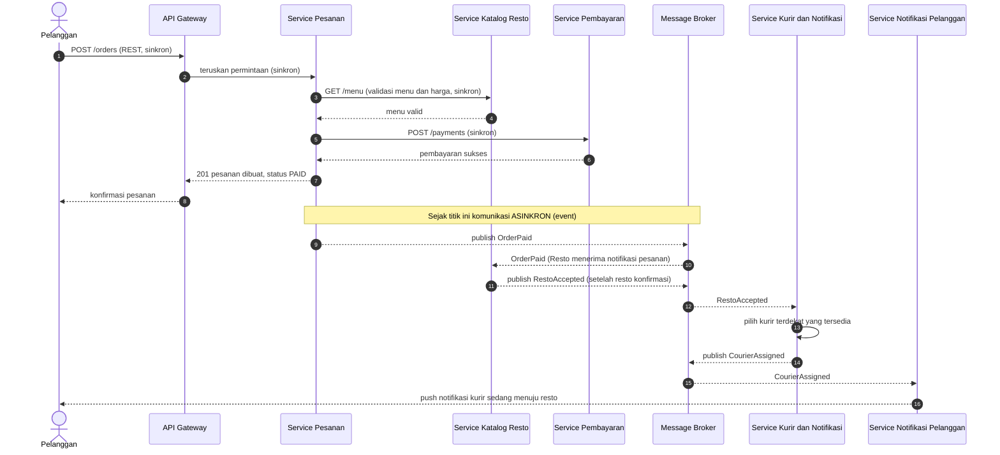

# Tugas 2 (Pekan 2) — Perancangan Arsitektur untuk FoodGo

**Materi terkait:** Architectural style (Layered, SOA, Peer-to-Peer, Publish-Subscribe).

## Studi Kasus

Melanjutkan Tugas 1: FoodGo butuh sistem yang **decoupled** agar tim kurir dan tim resto tidak saling mengganggu ketika salah satu modul diperbarui/deploy ulang. Saat ini semua modul (pesanan, pembayaran, notifikasi kurir, katalog resto) berjalan sebagai satu aplikasi monolitik — sekali deploy, semua modul ikut restart dan berisiko downtime total.

## Tugas Kelompok

1. Pilih **satu** gaya arsitektur utama: **Service-Oriented Architecture (SOA)** atau **Publish-Subscribe**. Boleh dikombinasikan (mis. SOA untuk service inti + Pub-Sub untuk notifikasi), tapi harus dijustifikasi kenapa kombinasi ini yang dipilih.
2. Gambarkan minimal 4 komponen berikut dan interaksinya: modul Pesanan, modul Pembayaran, modul Kurir/Notifikasi, modul Katalog Resto (dan message broker/API gateway jika relevan).
3. Jelaskan alur satu skenario penuh secara end-to-end di diagram (misalnya: pelanggan buat pesanan → bayar → resto terima notifikasi → kurir ditugaskan) — tunjukkan komponen mana berkomunikasi dengan siapa, dan **jenis komunikasinya** (sinkron/asinkron, request-response/event).
4. Analisis tertulis: kenapa gaya ini mengatasi masalah *coupling* dari Tugas 1, dan apa trade-off-nya (mis. Pub-Sub menambah kompleksitas debugging karena alur tidak linear).

## Tugas 2 — Perancangan Arsitektur FoodGo

### 1. Gaya Arsitektur yang Dipilih

**Kombinasi: SOA (service inti) + Publish-Subscribe (notifikasi dan koordinasi, asinkron).**

| Bagian sistem | Gaya | Komunikasi | Alasan |
|---|---|---|---|
| Client → API Gateway → Service | SOA (REST) | Sinkron, request-response | Klien butuh jawaban langsung |
| Order → Katalog (cek menu/harga) | SOA | Sinkron, request-response, timeout | Validasi harus selesai sebelum menu valid |
| Order → Payment | SOA | Sinkron, request-response, timeout + retry + idempotency key | Hasil pembayaran harus pasti sebelum pesanan lanjut  |
| Order → Resto, Kurir, Notifikasi pelanggan | Publish-Subscribe | Asinkron, event | Order tidak perlu tahu siapa penerimanya dan tidak boleh gagal hanya karena penerima sedang down |

#### Justifikasi kenapa kami jatuh ke arsitektur kombinasi

- **Opsi 1: SOA:** Jika Order memanggil Kurir dan Resto secara sinkron, Order tetap *coupled* ke keduanya: saat service Kurir sedang deploy ulang, pesanan pelanggan ikut gagal. Ini mengulang masalah monolit dalam bentuk lain.
- **Opsi 2: Pub-Sub.** Pembayaran butuh kepastian hasil sebelum pesanan dilanjutkan. Kalau dibuat event murni, alur menjadi tidak linear dan sulit dikontrol tepat di titik yang paling sensitif (uang).
- **Kombinasi:** Alur butuh jawaban langsung memakai request-response, dan setiap panggilannya diberi timeout dan retry terbatas. alur yang berupa "beri tahu pihak lain bahwa sesuatu terjadi" memakai event (Pub-Sub).

## 2. Diagram Komponen

- Garis **solid** = komunikasi sinkron (request-response). Garis **putus-putus** = komunikasi asinkron (event via broker).

Setiap service memiliki **database sendiri** agar tidak ada ketergantungan lewat data bersama (sumber *coupling* yang sering terlewat).

## 3. Skenario End-to-End: Pelanggan Pesan → Bayar → Resto Menerima → Kurir Ditugaskan.

### Ringkasan jenis komunikasi

| # | Dari → Ke | Jenis | Pola |
|---|---|---|---|
| 1 | Pelanggan → API Gateway → Service Pesanan | Sinkron | Request-response (REST, HTTP method POST) |
| 2 | Service Pesanan → Service Katalog | Sinkron | Request-response (GET) |
| 3 | Service Pesanan → Service Pembayaran | Sinkron | Request-response (POST) |
| 4 | Service Pesanan → Broker (`OrderPaid`) | Asinkron | Event, publish |
| 5 | Broker → Katalog Resto / Kurir | Asinkron | Event, subscribe |
| 6 | Katalog Resto → Broker (`RestoAccepted`) | Asinkron | Event, publish |
| 7 | Service Kurir → Broker (`CourierAssigned`) → Notifikasi Pelanggan | Asinkron | Event, publish/subscribe |

## 4. Analisis: Kenapa Gaya Ini Mengatasi Masalah Coupling

**Gaya yang dipilih: kombinasi SOA + Publish-Subscribe.** Service inti (Pesanan, Pembayaran, Katalog Resto) dipisah sebagai service mandiri dan saling memanggil secara **sinkron** (REST/RPC) untuk langkah yang hasilnya harus diketahui saat itu juga, misalnya Pesanan → Pembayaran. Notifikasi ke resto dan kurir memakai **Pub-Sub** (asinkron, berbasis event lewat message broker), karena Service Pesanan tidak perlu menunggu atau mengetahui siapa yang bereaksi terhadap pesanan. Kombinasi ini dipilih karena Pub-Sub saja tidak cocok untuk langkah yang butuh jawaban langsung (mis. pembayaran berhasil atau tidak), sedangkan SOA murni dengan panggilan sinkron di semua jalur akan mempertahankan *coupling* antara tim kurir dan tim resto.

1. **Deploy independen.** Tim kurir men-deploy ulang Service Kurir dan Notifikasi tanpa menyentuh Pesanan, Pembayaran, atau Katalog. Tidak ada restart massal dan downtime total.
2. **Isolasi kegagalan.** Jika Service Kurir mati, Service Pesanan tetap menerima dan menyimpan pesanan. Event `OrderPaid` menunggu di antrean broker dan diproses saat Service Notifikasi Kurir hidup kembali (dengan asumsi antrean bersifat *durable*). Pada monolit, kegagalan satu modul, misalnya thread yang menggantung menunggu modul pembayaran tanpa *timeout*, menjatuhkan seluruh aplikasi.
3. **Loose Coupling.** Publisher tidak tahu siapa subscriber-nya. Menambah subscriber baru (mis. layanan promo atau analitik) tidak mengubah kode Service Pesanan.
4. **Publisher tidak terblokir (*asynchronous, non-blocking*).** Setelah mempublikasikan `OrderPaid`, Service Pesanan langsung melanjutkan pekerjaannya tanpa menunggu resto atau kurir selesai memproses. Pekerjaan berat di sisi subscriber tidak memperlambat jalur utama pesanan.
5. **Scaling per kebutuhan.** Saat jam makan siang atau promo besar, Service Pesanan dan Service Notifikasi Kurir bisa diperbanyak instance-nya tanpa ikut menggandakan Service Katalog Resto. Pada monolit, seluruh aplikasi harus digandakan.

## Analisis Trade-off (Kelemahan dan Kompleksitas Baru) dan Catatan migrasi bertahap.

### - Analisis Trade-off

| Trade-off | Penjelasan | Mitigasi |
|---|---|---|
| **Debugging lebih sulit** | Alur pesanan tidak lagi linear: satu pesanan melewati banyak service dan event. Sulit melacak "event `OrderPaid` ini macet di mana", misalnya pesanan sudah dibayar tetapi resto belum menerima notifikasi. | *Correlation ID* (`order_id`) di semua log dan event, *distributed tracing*, log terpusat |
| **Message broker jadi titik kritis** | Jika broker mati, alur event terhenti (*single point of failure*), sehingga resto dan kurir tidak mendapat notifikasi. | Broker dalam mode cluster/replikasi, *health check* |
| **Konsistensi akhir (*eventual consistency*)** | Status pesanan di service berbeda tidak langsung sama pada detik yang sama (mis. Pesanan sudah "PAID" tetapi Kurir belum mengetahuinya). | UI yang menampilkan status "diproses", model status yang jelas |
| **Pesan ganda / gagal terkirim** | Event bisa terkirim lebih dari sekali atau gagal diproses subscriber, sehingga kurir bisa ditugaskan dua kali untuk satu pesanan. | Consumer *idempotent*, *retry* dengan batas, *dead-letter queue* |
| **Latensi dan kegagalan jaringan pada panggilan sinkron** | Panggilan Service Pesanan → Service Pembayaran (dan Katalog Resto) kini lewat jaringan, bukan pemanggilan fungsi lokal, sehingga rentan lambat atau putus. Ini kembali ke *Fallacies of Distributed Computing* dan persis gejala di studi kasus: menunggu tanpa batas waktu. | *Timeout* wajib di setiap panggilan, *retry* dengan *exponential backoff*, *circuit breaker* |
| **Kompleksitas operasional** | Banyak service, banyak database, broker, dan gateway yang harus di-deploy dan dipantau. | Container (Docker) dan orkestrasi (Docker Swarm/Kubernetes) |
| **Transaksi lintas service** | Tidak ada satu transaksi database untuk "bayar + buat pesanan + kabari resto"; kegagalan di tengah alur harus dikompensasi (mis. pembayaran sukses tetapi pesanan gagal disimpan). | Status pesanan eksplisit (`PENDING`, `PAID`, dst.), langkah kompensasi/refund |
| **Overhead untuk tim kecil** | Untuk aplikasi kecil, arsitektur berbasis service bisa berlebihan dibanding monolit. | Migrasi bertahap: pecah modul yang paling sering berubah lebih dulu (mis. Notifikasi Kurir) |

### - Catatan Migrasi Bertahap

Karena FoodGo sudah berjalan sebagai monolit, migrasi tidak harus sekaligus. Monolit lama dapat dibungkus dengan *wrapper/middleware* sehingga service baru berkomunikasi lewat REST ke pembungkus tersebut, lalu modul dipecah satu per satu, dimulai dari Notifikasi Kurir. Skema wrapper ini hanya **tahap transisi**. Arsitektur akhirnya tetap seperti pada diagram: service mandiri dengan komunikasi sinkron untuk jalur inti dan event lewat broker untuk notifikasi.

## Batasan Penggunaan AI (Level 2)

Kebijakan **Level 2 (AI Assisted Idea Generation & Structuring)** berlaku — lihat [`../RUBRIK-UMUM.md`](../RUBRIK-UMUM.md). Boleh memakai AI untuk brainstorming komponen apa saja yang umum ada di gaya arsitektur SOA/Pub-Sub; **tidak boleh** meminta AI menggambar diagram final atau menuliskan analisis trade-off yang tinggal ditempel. Catat pemakaian AI di "Log Penggunaan AI" pada `JURNAL.md`.

- Diagram Mermaid/draw.io yang "terlalu generik" (identik dengan contoh tutorial di internet tanpa penyesuaian ke kasus FoodGo) akan dinilai rendah pada komponen kelengkapan & kejelasan diagram.
