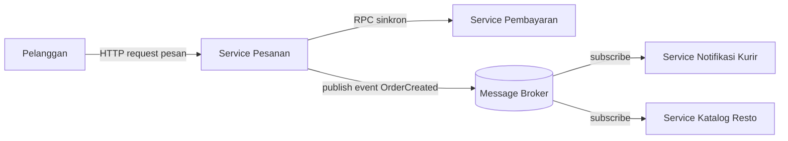

# Tugas 2 (Pekan 2) — Perancangan Arsitektur untuk FoodGo

**Materi terkait:** *Architectural style* (*Layered*, SOA, *Peer-to-Peer*, *Publish-Subscribe*).

## Studi Kasus

Melanjutkan Tugas 1: FoodGo butuh sistem yang **decoupled** agar tim kurir dan tim resto tidak saling mengganggu ketika salah satu modul diperbarui/deploy ulang. Saat ini semua modul (pesanan, pembayaran, notifikasi kurir, katalog resto) berjalan sebagai satu aplikasi monolitik — sekali deploy, semua modul ikut restart dan berisiko downtime total.

## Tugas Kelompok

1. Pilih **satu** gaya arsitektur utama: **Service-Oriented Architecture (SOA)** atau **Publish-Subscribe**. Boleh dikombinasikan (mis. SOA untuk service inti + Pub-Sub untuk notifikasi), tapi harus dijustifikasi kenapa kombinasi ini yang dipilih.
2. Gambarkan minimal 4 komponen berikut dan interaksinya: modul Pesanan, modul Pembayaran, modul Kurir/Notifikasi, modul Katalog Resto (dan message broker/API gateway jika relevan).
3. Jelaskan alur satu skenario penuh secara end-to-end di diagram (misalnya: pelanggan buat pesanan → bayar → resto terima notifikasi → kurir ditugaskan) — tunjukkan komponen mana berkomunikasi dengan siapa, dan **jenis komunikasinya** (sinkron/asinkron, request-response/event).
4. Analisis tertulis: kenapa gaya ini mengatasi masalah *coupling* dari Tugas 1, dan apa trade-off-nya (mis. Pub-Sub menambah kompleksitas debugging karena alur tidak linear).


## Tugas 2 — Perancangan Arsitektur FoodGo


### 1. Gaya Arsitektur yang Dipilih
Sebelum menentukan arsitektur yang cocok, kami ingin membahas apa itu SOA dan Pub-Sub.

SOA (*Service-Oriented Architecture*) adalah gaya arsitektur yang memecah sistem menjadi beberapa layanan atau *service* terpisah yang saling memanggil lewat jaringan.

Sedangkan *Publish-Subscribe* (Pub-Sub) yaitu gaya komunikasi di mana pengirim (*publisher*) menyiarkan pesan ke saluran tertentu, dan pihak yang berminat (*subscriber*) menerimanya, tanpa keduanya saling mengenal.

Dari kedua definisi di atas, kami memilih *arsitektur kombinasi* yaitu **SOA untuk service inti dan Publish-Subscribe untuk notifikasi dan koordinasi, asinkron.** Adapun penjelasannya sebagai berikut.


| Bagian sistem | Gaya | Komunikasi | Alasan |
|---|---|---|---|
| Client → API Gateway → Service | SOA (REST) | Sinkron, *request-response* | Klien butuh jawaban langsung |
| Order → Katalog (cek menu/harga) | SOA | Sinkron, *request-response*, *timeout* | Validasi harus selesai sebelum menu valid |
| Order → Payment | SOA | Sinkron, *request-response*, *timeout* + *retry* + *idempotency key* | Hasil pembayaran harus pasti sebelum pesanan lanjut  |
| Order → Resto, Kurir, Notifikasi pelanggan | Publish-Subscribe | Asinkron, *event* | Order tidak perlu tahu siapa penerimanya dan tidak boleh gagal hanya karena penerima sedang down |

#### Justifikasi kenapa kami memilih arsitektur kombinasi

- **Opsi 1: SOA:** Jika Order memanggil Kurir dan Resto secara sinkron, Order akan tetap bergantung pada ke keduanya (*coupled*) sehingga jika salah satu dari keduanya sedang ada kendala, maka Order akan gagal. Contoh: saat service Kurir sedang *update* versi aplikasi atau *deploy* ulang, pesanan pelanggan ikut gagal. Jadi jika menggunakan solusi ini akan mengulang masalah monolit dalam bentuk lain.
- **Opsi 2: Pub-Sub.** Pembayaran butuh kepastian hasil sebelum pesanan dilanjutkan. Kalau dibuat *event* murni/asinkron, alur menjadi kacau dan sulit dikontrol tepat di titik yang paling sensitif (uang). Contoh: saat *user* menekan tombol bayar, *event* pembayaran terkirim. Namun misalkan *user* ingin membatalkan pembayaran dengan menekan tombol batalkan pembayaran, ada kemungkinan *event* pembatalan pembayaran lebih cepat diproses oleh sistem sehingga sistem/alurnya menjadi kacau dan bahkan uang *user* tetap terpotong.
- **PIlihan kami: Kombinasi SOA+Pub-Sub**. Alur yang butuh jawaban langsung memakai *request-response*, dan setiap panggilannya diberi *timeout* dan *retry* terbatas. Alur yang berupa "beri tahu pihak lain bahwa sesuatu terjadi" memakai *event* atau Pub-Sub.


## 2. Diagram Komponen

- Garis **solid** = komunikasi sinkron (request-response). Garis **putus-putus** = komunikasi asinkron (event via broker).



## Struktur Submission

```
tugas-02-perancangan-arsitektur/
├── README.md          # Analisis + diagram Mermaid (jika Opsi A) atau referensi ke diagram/
├── JURNAL.md
└── diagram/            # File .png/.drawio jika pakai Opsi B
```

## Rubrik Penilaian (Tugas 2)

| Komponen | Bobot | Kriteria |
|---|---|---|
| Ketepatan pemilihan gaya arsitektur | 20% | Justifikasi SOA/Pub-Sub sesuai kebutuhan *decoupling* di skenario |
| Kelengkapan & kejelasan diagram | 30% | Semua komponen kunci ada, jenis komunikasi (sinkron/asinkron) jelas ditandai |
| Analisis trade-off | 30% | Bukan hanya kelebihan — kekurangan/kompleksitas baru juga dibahas |
| Proses & kontribusi kelompok | 20% | `JURNAL.md`, commit history |

## Batasan Penggunaan AI (Level 2)

Kebijakan **Level 2 (AI Assisted Idea Generation & Structuring)** berlaku — lihat [`../RUBRIK-UMUM.md`](../RUBRIK-UMUM.md). Boleh memakai AI untuk brainstorming komponen apa saja yang umum ada di gaya arsitektur SOA/Pub-Sub; **tidak boleh** meminta AI menggambar diagram final atau menuliskan analisis trade-off yang tinggal ditempel. Catat pemakaian AI di "Log Penggunaan AI" pada `JURNAL.md`.

- Diagram Mermaid/draw.io yang "terlalu generik" (identik dengan contoh tutorial di internet tanpa penyesuaian ke kasus FoodGo) akan dinilai rendah pada komponen kelengkapan & kejelasan diagram.
